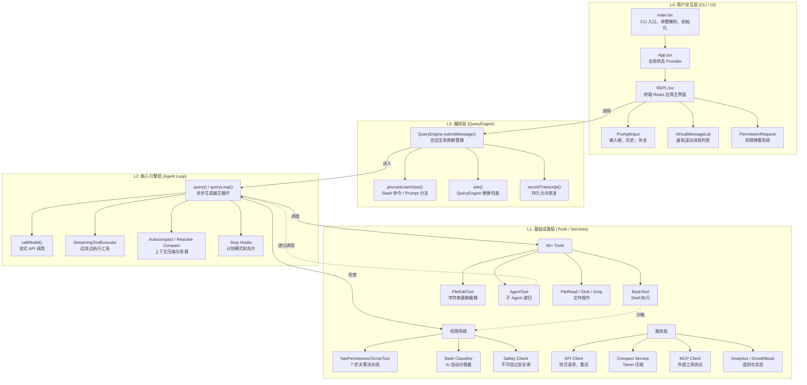
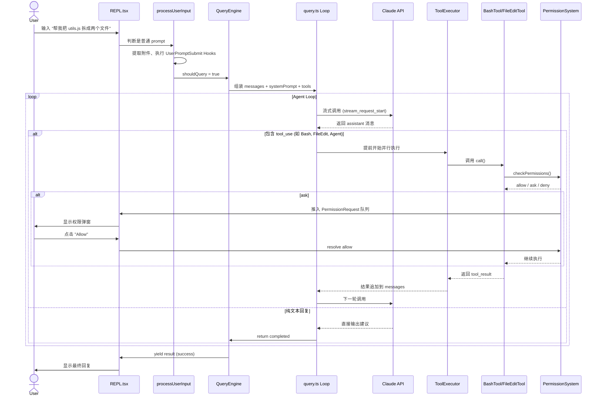
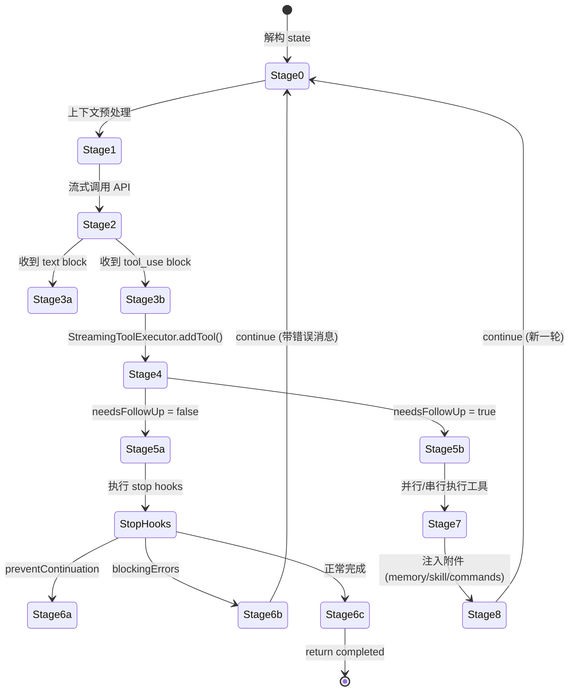
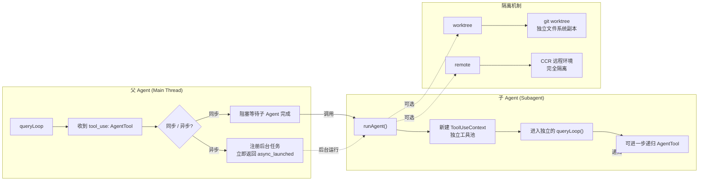
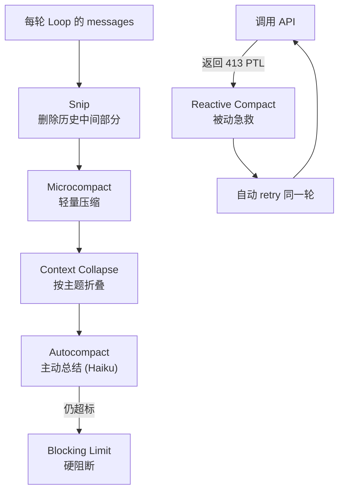
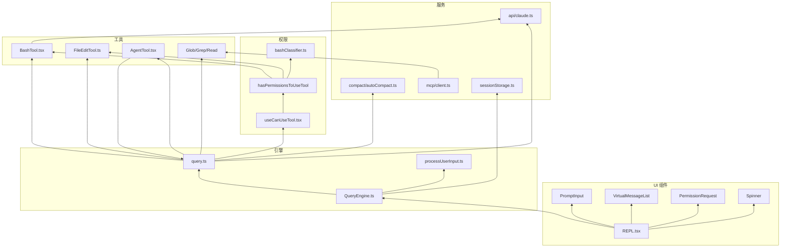

# Claude Code 完整架构图

> 本文档基于 Claude Code v2.1.88 源码，用多层级架构图展示系统全貌。建议配合 `01-05` 专题文档逐层阅读。

---

## 一、系统分层总览



---

## 二、数据流：一次用户输入的完整旅程



---

## 三、Agent Loop 内部状态机



---

## 四、权限系统决策树

```mermaid
flowchart TD
    Start([模型请求使用工具]) --> S1{Step 1a:<br/>工具级 deny 规则?}
    S1 -->|是| Deny1[deny]
    S1 -->|否| S2{Step 1b:<br/>工具级 ask 规则?}
    
    S2 -->|是| Ask1[ask]
    S2 -->|否| S3{Step 1c:<br/>tool.checkPermissions()}
    
    S3 -->|deny| Deny2[deny]
    S3 -->|ask| S4{Step 1e/f/g:<br/>免疫 bypass?}
    S3 -->|passthrough| S8
    
    S4 -->|是| Ask2[ask]
    S4 -->|否| S5{Step 2a:<br/>bypassPermissions 模式?}
    
    S5 -->|是| Allow1[allow]
    S5 -->|否| S6{Step 2b:<br/>工具级 allow 规则?}
    
    S6 -->|是| Allow2[allow]
    S6 -->|否| S8[passthrough → ask]
    
    S8 --> S9{外层模式转换?}
    S9 -->|dontAsk| Deny3[deny]
    S9 -->|auto| S10{AI 分类器}
    S9 -->|其他| Ask3[ask 弹窗]
    
    S10 -->|高置信度 allow| Allow3[auto allow]
    S10 -->|低置信度 / 拒识| Ask4[ask 弹窗]
    S10 -->|连续拒绝超限| Ask5[降级到弹窗]
```

---

## 五、子 Agent 递归架构



---

## 六、上下文压缩防御体系



---

## 七、组件依赖关系图



---

## 八、文件速查导航

按功能模块快速定位源码：

### 核心循环
| 文件 | 内容 |
|------|------|
| `src/query.ts` | Agent Loop 心脏 |
| `src/QueryEngine.ts` | 会话编排与 SDK 接口 |
| `src/replLauncher.tsx` | REPL 启动器 |

### 工具系统
| 文件 | 内容 |
|------|------|
| `src/Tool.ts` | 工具接口与 `buildTool` |
| `src/tools.ts` | 工具注册中心 |
| `src/tools/BashTool/BashTool.tsx` | Bash 执行 |
| `src/tools/FileEditTool/FileEditTool.ts` | 文件编辑 |
| `src/tools/AgentTool/AgentTool.tsx` | 子 Agent |
| `src/services/tools/StreamingToolExecutor.ts` | 流式工具执行器 |

### 权限与安全
| 文件 | 内容 |
|------|------|
| `src/hooks/useCanUseTool.tsx` | 权限总入口 |
| `src/utils/permissions/permissions.ts` | 7 步决策引擎 |
| `src/utils/permissions/bashClassifier.ts` | Bash 分类器 |
| `src/utils/permissions/denialTracking.ts` | 连续拒绝追踪 |
| `src/components/permissions/PermissionRequest.tsx` | 弹窗分发器 |

### 上下文压缩
| 文件 | 内容 |
|------|------|
| `src/services/compact/autoCompact.ts` | 主动压缩 |
| `src/services/compact/reactiveCompact.ts` | 被动急救 |
| `src/services/compact/compact.ts` | 压缩实现 |

### UI 与状态
| 文件 | 内容 |
|------|------|
| `src/screens/REPL.tsx` | 主界面 |
| `src/components/App.tsx` | 全局 Provider |
| `src/components/PromptInput/PromptInput.tsx` | 输入框 |
| `src/components/VirtualMessageList.tsx` | 虚拟滚动 |
| `src/state/AppState.tsx` | 全局状态定义 |

### 输入处理
| 文件 | 内容 |
|------|------|
| `src/utils/processUserInput/processUserInput.ts` | 输入分支处理 |
| `src/utils/handlePromptSubmit.ts` | 提交处理器 |
| `src/utils/queryContext.ts` | System Prompt 组装 |

---

*文档生成时间：2026-04-14*  
*基于源码版本：Claude Code v2.1.88*
